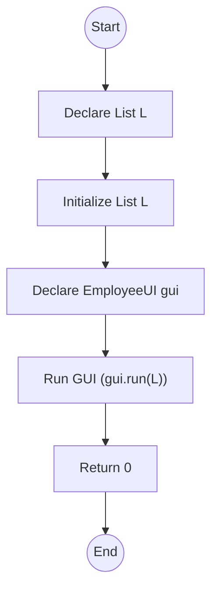
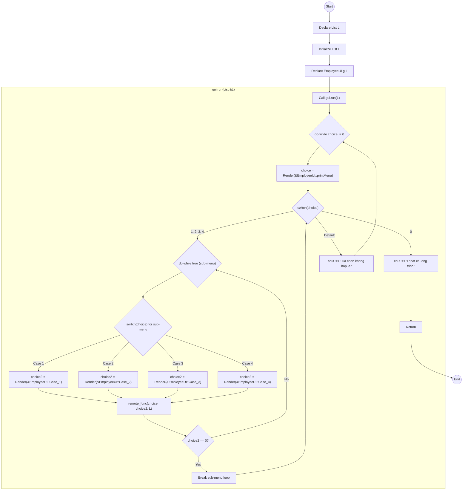
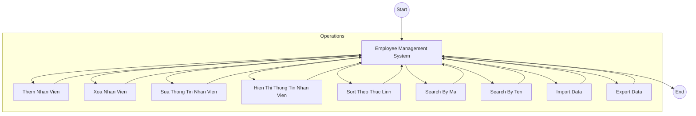
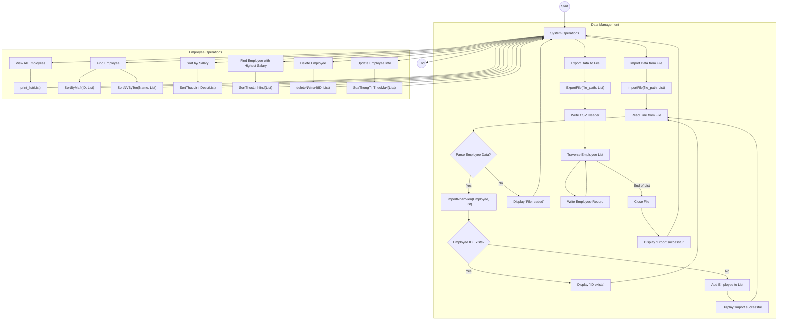
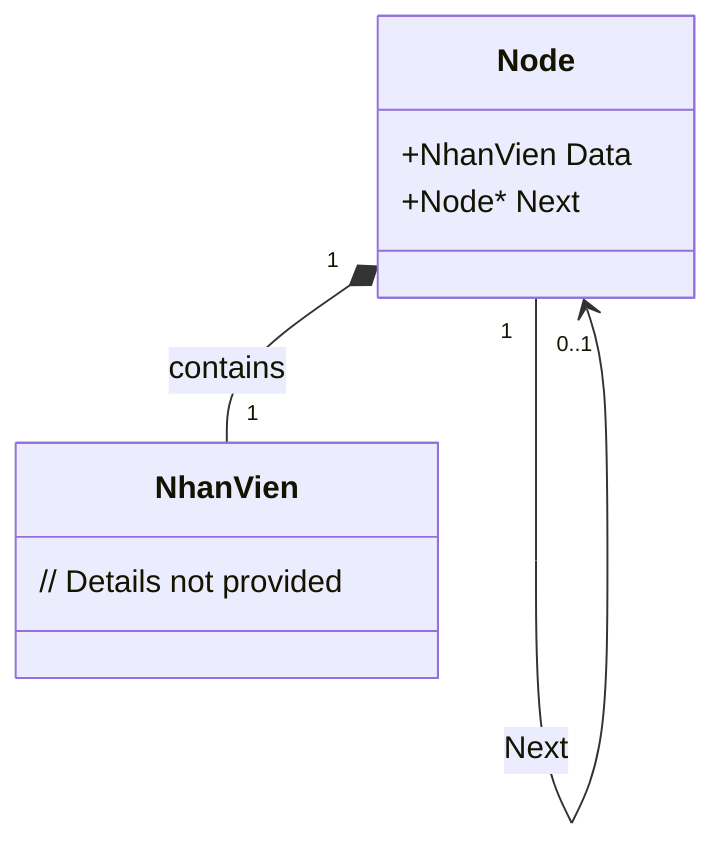
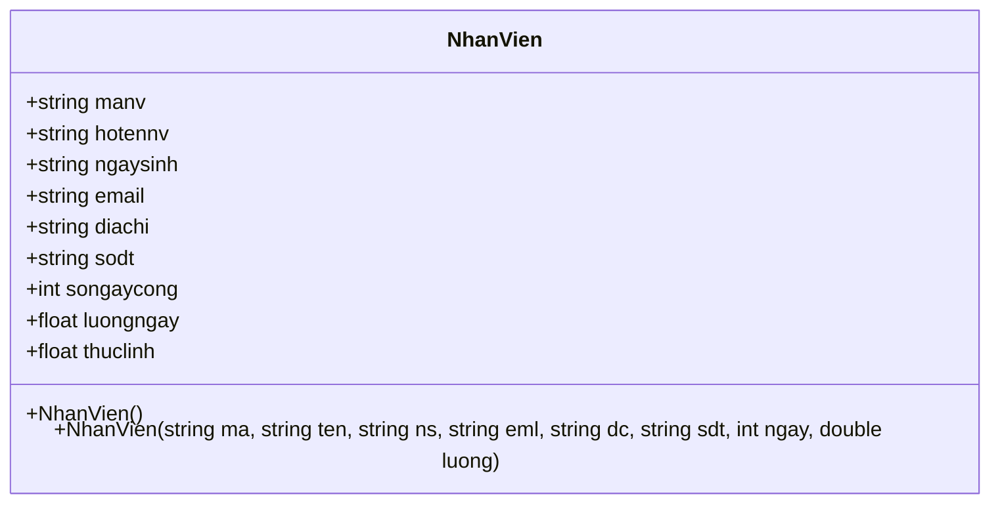

### main.cpp

```mermaid
flowchart TD
    start_node((Start))
    declare_list[Declare List L]
    init_list[Initialize List L]
    declare_gui[Declare EmployeeUI gui]
    run_gui["Run GUI (gui.run(L))"]
    return_zero[Return 0]
    end_node((End))

    start_node --> declare_list
    declare_list --> init_list
    init_list --> declare_gui
    declare_gui --> run_gui
    run_gui --> return_zero
    return_zero --> end_node

```
### GUI.cpp

```mermaid
flowchart TD
    A((Start)) --> B[Declare List L]
    B --> C[Initialize List L]
    C --> D[Declare EmployeeUI gui]
    D --> E["Call gui.run(L)"]

    subgraph gui_run["gui.run(List &L)"]
        E --> F{"do-while choice != 0"}
        F --> G["choice = Render(&EmployeeUI::printMenu)"]
        G --> H{"switch(choice)"}

        H -- "1, 2, 3, 4" --> I{"do-while true (sub-menu)"}
        I --> J{"switch(choice) for sub-menu"}

        J -- "Case 1" --> K["choice2 = Render(&EmployeeUI::Case_1)"]
        J -- "Case 2" --> L["choice2 = Render(&EmployeeUI::Case_2)"]
        J -- "Case 3" --> M["choice2 = Render(&EmployeeUI::Case_3)"]
        J -- "Case 4" --> N["choice2 = Render(&EmployeeUI::Case_4)"]

        K --> O["remote_func(choice, choice2, L)"]
        L --> O
        M --> O
        N --> O

        O --> P{"choice2 == 0?"}
        P -- "Yes" --> Q["Break sub-menu loop"]
        P -- "No" --> I

        Q --> H

        H -- "0" --> R["cout << 'Thoat chuong trinh.'"]
        R --> S[Return]

        H -- "Default" --> T["cout << 'Lua chon khong hop le.'"]
        T --> F
    end

    S --> U((End))
```

### modified_function.cpp

``` mermaid
flowchart TD
    Start((Start)) --> MainMenu[Employee Management System]

    subgraph Operations
        MainMenu --> ThemNhanVien[Them Nhan Vien]
        MainMenu --> XoaNhanVien[Xoa Nhan Vien]
        MainMenu --> SuaThongTinNhanvien[Sua Thong Tin Nhan Vien]
        MainMenu --> HienThiThongTinNhanVien[Hien Thi Thong Tin Nhan Vien]
        MainMenu --> SortTheoThucLinh[Sort Theo Thuc Linh]
        MainMenu --> SearchByMa[Search By Ma]
        MainMenu --> SearchByTen[Search By Ten]
        MainMenu --> ImportData[Import Data]
        MainMenu --> ExportData[Export Data]
    end

    ThemNhanVien --> MainMenu
    XoaNhanVien --> MainMenu
    SuaThongTinNhanvien --> MainMenu
    HienThiThongTinNhanVien --> MainMenu
    SortTheoThucLinh --> MainMenu
    SearchByMa --> MainMenu
    SearchByTen --> MainMenu
    ImportData --> MainMenu
    ExportData --> MainMenu

    MainMenu --> End((End))
```

### data_process.cpp

```mermaid
flowchart TD
    Start((Start)) --> MainMenu["System Operations"]

    subgraph Data_Management["Data Management"]
        MainMenu --> ImportData["Import Data from File"]
        ImportData --> ImportFile["ImportFile(file_path, List)"]
        ImportFile --> ReadLine["Read Line from File"]
        ReadLine --> ParseData{"Parse Employee Data?"}
        ParseData -- "Yes" --> CallImportNV["ImportNhanVien(Employee, List)"]
        CallImportNV --> CheckDuplicate{"Employee ID Exists?"}
        CheckDuplicate -- "Yes" --> DuplicateMsg["Display 'ID exists'"]
        CheckDuplicate -- "No" --> AddToList["Add Employee to List"]
        AddToList --> SuccessMsg["Display 'Import successful'"]
        DuplicateMsg --> ReadLine
        SuccessMsg --> ReadLine
        ParseData -- "No" --> FileReaded["Display 'File readed'"]
        FileReaded --> MainMenu

        MainMenu --> ExportData["Export Data to File"]
        ExportData --> ExportFile["ExportFile(file_path, List)"]
        ExportFile --> WriteHeader["Write CSV Header"]
        WriteHeader --> TraverseList["Traverse Employee List"]
        TraverseList --> WriteRecord["Write Employee Record"]
        WriteRecord --> TraverseList
        TraverseList -- "End of List" --> CloseFile["Close File"]
        CloseFile --> ExportSuccess["Display 'Export successful'"]
        ExportSuccess --> MainMenu
    end

    subgraph Employee_Operations["Employee Operations"]
        MainMenu --> ViewEmployees["View All Employees"]
        ViewEmployees --> PrintList["print_list(List)"]
        PrintList --> MainMenu

        MainMenu --> FindEmployee["Find Employee"]
        FindEmployee --> FindByID["SortByMa4(ID, List)"]
        FindEmployee --> FindByName["SortNVByTen(Name, List)"]
        FindByID --> MainMenu
        FindByName --> MainMenu

        MainMenu --> SortEmployees["Sort by Salary"]
        SortEmployees --> SortDesc["SortThucLinhDesc(List)"]
        SortDesc --> MainMenu

        MainMenu --> FindHighestSalary["Find Employee with Highest Salary"]
        FindHighestSalary --> FindMax["SortThucLinhfind(List)"]
        FindMax --> MainMenu

        MainMenu --> DeleteEmployee["Delete Employee"]
        DeleteEmployee --> DeleteByID["deleteNVma4(ID, List)"]
        DeleteByID --> MainMenu

        MainMenu --> UpdateEmployee["Update Employee Info"]
        UpdateEmployee --> UpdateByID["SuaThongTinTheoMa4(List)"]
        UpdateByID --> MainMenu
    end

    MainMenu --> End((End))
```
### LinkedList.cpp

```mermaid
classDiagram
  class NhanVien {
    // Details not provided
  }

  class Node {
    +NhanVien Data
    +Node* Next
  }

  Node "1" *-- "1" NhanVien : contains
  Node "1" --> "0..1" Node : Next

```
### NhanVien.cpp

```mermaid
classDiagram
  class NhanVien {
    +string manv
    +string hotennv
    +string ngaysinh
    +string email
    +string diachi
    +string sodt
    +int songaycong
    +float luongngay
    +float thuclinh
    +NhanVien()
    +NhanVien(string ma, string ten, string ns, string eml, string dc, string sdt, int ngay, double luong)
  }
```

### Full Model

``` mermaid
flowchart TD
    subgraph main.cpp
        main_start_node((Start))
        main_declare_list[Declare List L]
        main_init_list[Initialize List L]
        main_declare_gui[Declare EmployeeUI gui]
        main_run_gui["Run GUI (gui.run(L))"]
        main_return_zero[Return 0]
        main_end_node((End))

        main_start_node --> main_declare_list
        main_declare_list --> main_init_list
        main_init_list --> main_declare_gui
        main_declare_gui --> main_run_gui
        main_run_gui --> main_return_zero
        main_return_zero --> main_end_node
    end

    subgraph GUI.cpp
        gui_A((GUI Start))
        gui_B[Declare List L]
        gui_C[Initialize List L]
        gui_D[Declare EmployeeUI gui]
        gui_D --> gui_E["Call gui.run(L)"]

        gui_A --> gui_B
        gui_B --> gui_C
        gui_C --> gui_D

        subgraph gui_run["gui.run(List &L)"]
            gui_E --> gui_F{"do-while choice != 0"}
            gui_F --> gui_G["choice = Render(&EmployeeUI::printMenu)"]
            gui_G --> gui_H{"switch(choice)"}

            gui_H -- "1, 2, 3, 4" --> gui_I{"do-while true (sub-menu)"}
            gui_I --> gui_J{"switch(choice) for sub-menu"}

            gui_J -- "Case 1" --> gui_K["choice2 = Render(&EmployeeUI::Case_1)"]
            gui_J -- "Case 2" --> gui_L["choice2 = Render(&EmployeeUI::Case_2)"]
            gui_J -- "Case 3" --> gui_M["choice2 = Render(&EmployeeUI::Case_3)"]
            gui_J -- "Case 4" --> gui_N["choice2 = Render(&EmployeeUI::Case_4)"]

            gui_K --> gui_O["remote_func(choice, choice2, L)"]
            gui_L --> gui_O
            gui_M --> gui_O
            gui_N --> gui_O

            gui_O --> gui_P{"choice2 == 0?"}
            gui_P -- "Yes" --> gui_Q["Break sub-menu loop"]
            gui_P -- "No" --> gui_I

            gui_Q --> gui_H

            gui_H -- "0" --> gui_R["cout << 'Thoat chuong trinh.'"]
            gui_R --> gui_S[Return]

            gui_H -- "Default" --> gui_T["cout << 'Lua chon khong hop le.'"]
            gui_T --> gui_F
        end

        gui_S --> gui_U((GUI End))
    end

    subgraph modified_function.cpp
        mod_Start((Menu Start)) --> mod_MainMenu[Employee Management System]

        subgraph mod_Operations
            mod_MainMenu --> mod_ThemNhanVien[Them Nhan Vien]
            mod_MainMenu --> mod_XoaNhanVien[Xoa Nhan Vien]
            mod_MainMenu --> mod_SuaThongTinNhanvien[Sua Thong Tin Nhan Vien]
            mod_MainMenu --> mod_HienThiThongTinNhanVien[Hien Thi Thong Tin Nhan Vien]
            mod_MainMenu --> mod_SortTheoThucLinh[Sort Theo Thuc Linh]
            mod_MainMenu --> mod_SearchByMa[Search By Ma]
            mod_MainMenu --> mod_SearchByTen[Search By Ten]
            mod_MainMenu --> mod_ImportData[Import Data]
            mod_MainMenu --> mod_ExportData[Export Data]
        end

        mod_ThemNhanVien --> mod_MainMenu
        mod_XoaNhanVien --> mod_MainMenu
        mod_SuaThongTinNhanvien --> mod_MainMenu
        mod_HienThiThongTinNhanVien --> mod_MainMenu
        mod_SortTheoThucLinh --> mod_MainMenu
        mod_SearchByMa --> mod_MainMenu
        mod_SearchByTen --> mod_MainMenu
        mod_ImportData --> mod_MainMenu
        mod_ExportData --> mod_MainMenu

        mod_MainMenu --> mod_End((Menu End))
    end

    subgraph data_process.cpp
        data_Start((Data Ops Start)) --> data_MainMenu["System Operations"]

        subgraph data_Data_Management["Data Management"]
            data_MainMenu --> data_ImportData["Import Data from File"]
            data_ImportData --> data_ImportFile["ImportFile(file_path, List)"]
            data_ImportFile --> data_ReadLine["Read Line from File"]
            data_ReadLine --> data_ParseData{"Parse Employee Data?"}
            data_ParseData -- "Yes" --> data_CallImportNV["ImportNhanVien(Employee, List)"]
            data_CallImportNV --> data_CheckDuplicate{"Employee ID Exists?"}
            data_CheckDuplicate -- "Yes" --> data_DuplicateMsg["Display 'ID exists'"]
            data_CheckDuplicate -- "No" --> data_AddToList["Add Employee to List"]
            data_AddToList --> data_SuccessMsg["Display 'Import successful'"]
            data_DuplicateMsg --> data_ReadLine
            data_SuccessMsg --> data_ReadLine
            data_ParseData -- "No" --> data_FileReaded["Display 'File readed'"]
            data_FileReaded --> data_MainMenu

            data_MainMenu --> data_ExportData["Export Data to File"]
            data_ExportData --> data_ExportFile["ExportFile(file_path, List)"]
            data_ExportFile --> data_WriteHeader["Write CSV Header"]
            data_WriteHeader --> data_TraverseList["Traverse Employee List"]
            data_TraverseList --> data_WriteRecord["Write Employee Record"]
            data_WriteRecord --> data_TraverseList
            data_TraverseList -- "End of List" --> data_CloseFile["Close File"]
            data_CloseFile --> data_ExportSuccess["Display 'Export successful'"]
            data_ExportSuccess --> data_MainMenu
        end

        subgraph data_Employee_Operations["Employee Operations"]
            data_MainMenu --> data_ViewEmployees["View All Employees"]
            data_ViewEmployees --> data_PrintList["print_list(List)"]
            data_PrintList --> data_MainMenu

            data_MainMenu --> data_FindEmployee["Find Employee"]
            data_FindEmployee --> data_FindByID["SortByMa4(ID, List)"]
            data_FindEmployee --> data_FindByName["SortNVByTen(Name, List)"]
            data_FindByID --> data_MainMenu
            data_FindByName --> data_MainMenu

            data_MainMenu --> data_SortEmployees["Sort by Salary"]
            data_SortEmployees --> data_SortDesc["SortThucLinhDesc(List)"]
            data_SortDesc --> data_MainMenu

            data_MainMenu --> data_FindHighestSalary["Find Employee with Highest Salary"]
            data_FindHighestSalary --> data_FindMax["SortThucLinhfind(List)"]
            data_FindMax --> data_MainMenu

            data_MainMenu --> data_DeleteEmployee["Delete Employee"]
            data_DeleteEmployee --> data_DeleteByID["deleteNVma4(ID, List)"]
            data_DeleteByID --> data_MainMenu

            data_MainMenu --> data_UpdateEmployee["Update Employee Info"]
            data_UpdateEmployee --> data_UpdateByID["SuaThongTinTheoMa4(List)"]
            data_UpdateByID --> data_MainMenu
        end

        data_MainMenu --> data_End((Data Ops End))
    end

    main_run_gui --> gui_E
    gui_S --> main_return_zero

    gui_O --> mod_MainMenu
    gui_O --> data_MainMenu

    mod_End --> gui_F
    data_End --> gui_F
```